# Fernando Rodrigues

Software Developer at **Adalink** · São Paulo, Brazil

I build products with LLMs inside them — agents, AI-backed APIs and the TypeScript apps around them.

---

### What I'm working on

Most of my time goes into wiring language models into real software: agents that split a problem across specialized roles, APIs that call Claude or GPT and validate what comes back, and background jobs that keep the slow parts out of the request cycle. Everything is TypeScript, end to end — web, mobile and backend.

### Projects

| Project | What it is | Built with |
|---|---|---|
| [**foodflow-ai**](https://github.com/FernandoRodriguesxs/foodflow-ai) | SaaS for restaurants that centralizes iFood and WhatsApp orders in one real-time panel | NestJS (Fastify) · Anthropic SDK · BullMQ + Redis · Drizzle · Neon · Socket.io · Next.js · Turborepo |
| [**tico-app**](https://github.com/FernandoRodriguesxs/tico-app) | Calorie tracker: you describe what you ate in plain text and an LLM estimates the calories | Expo · React Native · NativeWind · NestJS · Prisma · PostgreSQL · OpenAI |
| [**nexi-chatbot**](https://github.com/FernandoRodriguesxs/nexi-chatbot) | Streaming chat app | Next.js · Vercel AI SDK · OpenAI · Zod |

### Stack

  <picture>
    <source media="(prefers-color-scheme: dark)" srcset="./assets/stack-dark.svg">
    <source media="(prefers-color-scheme: light)" srcset="./assets/stack-light.svg">
    
  </picture>

### Right now

- Learning RAG and vector search properly, beyond the tutorial version
- Getting better at mobile with Expo
- Writing specs and ADRs before code, and letting Claude Code work from them

---

Open to projects and conversations about AI products — [fernando.hardd@gmail.com](mailto:fernando.hardd@gmail.com)

